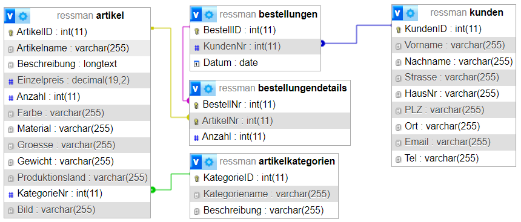

# `ressman`
 `ressman` ist ein c#-Projekt mit Windows Forms und einer MySQL-Datenbank 
im Rahmen des Umschulungsmoduls `c#-fortgeschritten`

## Projektkriterien des Bildungsträgers
- Erstellung einer Windows-Forms Anwendung
- Anbindung einer relationalen MySQL-Datenbank 
- Projektdauer waren effektiv 6 Tage

## Projektvorhaben
Erstellung eines Datenbankmanagementsystems für ein fiktives Unternehmen mit Ressourcenverwaltung.

## Projektziele (eigene Anforderungen)
- Entwurf gemäß Model-View-Controller
- Implementierung unter Berücksichtigung OOP-Programmierung
- Versionsverwaltung mit `git`

## Database / Model

- [download](https://github.com/SdfHbb/RessMan/blob/master/Ressources/ressman.sql)
